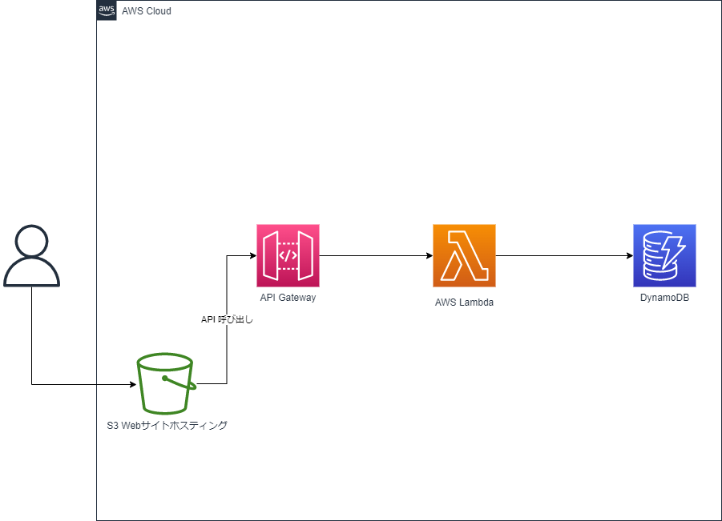

# ライセンスコード引き換えWebアプリ開発

## 仕様要件

### 目的

#### Must

- 受講者にライセンスコードを渡すのに、今まではPDFで渡していたが、情報漏洩とか、引き換えたかどうかとかがわからない
- なので、Webアプリにして受講者のメールアドレスを入力すると該当するライセンスコードを見れるようにしたい

#### More

- 管理画面からライセンスコード一覧をアップロードできるようにしたい
- 受講者がライセンスコードを引き換えたかどうか知りたい
- 管理画面は認証が必要

## 構成図

## 作り方

1. AWSのマネコンでサーバーサイドのAPIを作成
   1. DB設計
2. フロントエンドを作成
3. 管理画面の作成
4. 認証の作成
5. サーバーサイドをIaCに変換
   1. SAM(Serverless Application Model)
      1. https://aws.amazon.com/jp/serverless/sam/
   2. CDK(Cloud Development Kit)
      1. https://aws.amazon.com/jp/cdk/

### DB設計

#### テーブル名

licences

#### データ設計

| 属性（日本語）     | Attribute     | Type               |
| ------------------ | ------------- | ------------------ |
| メールアドレス     | email         | パーティションキー |
| トレーニング受講日 | training-date | ソートキー         |
| ライセンスコード   | licence-code  | String             |
| 引き換え日時       | exchange-date | Datetime or String |
